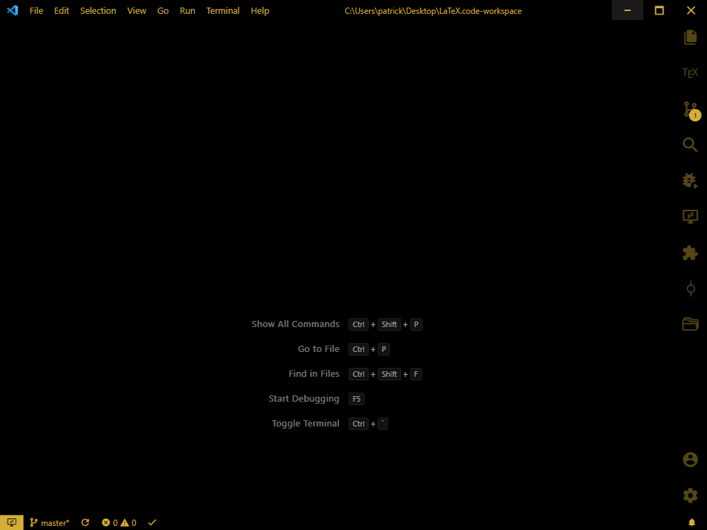
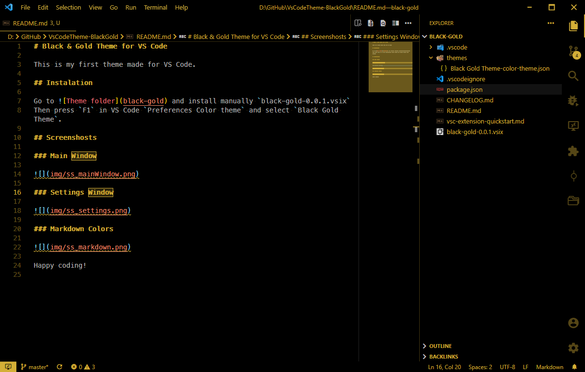

# Black & Gold Theme for VS Code

This is my first theme made for VS Code.

## Instalation

Go to `black-gold` directory and install manually `black-gold-0.0.1.vsix`
Then press `F1` in VS Code `Preferences Color theme` and select `Black Gold Theme`.

## Screenshosts

### Main Window

### Settings Window

### Markdown Colors

Happy coding!
